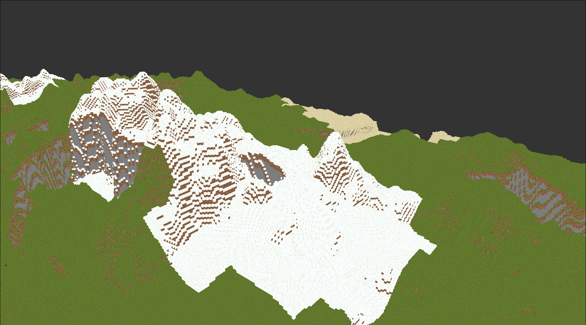

# Voxel Engine

A high-performance, voxel-based engine with Minecraft-style terrain written in **C++** using **OpenGL**.

This project implements a custom rendering pipeline to handle large-scale, chunked environments efficiently, focusing on low-level memory management and modern graphics techniques.

## 📸 Screenshots



## 🛠 Features

* **Custom OpenGL Wrapper:** Clean abstraction classes for Shaders, VBOs, VAOs, and EBOs.
* **Chunk Management:** Data-oriented chunking system for efficient world storage and updates.
* **Procedural Rendering:** Optimized face-culling to ensure only visible surfaces are sent to the GPU.
* **GLSL Shaders:** Custom vertex and fragment shaders for transformations and texture mapping.

## 🏗 Build Instructions

This project uses **CMake**. Ensure you have a C++ compiler.
CMake should handle downloading and installing the necessary development headers.

```bash
# Clone the repository
git clone git@github.com:JackCarluccio/voxel-engine.git
cd voxel-engine

# Configure the build
cmake -S . -B build/

# Build the project
cmake --build build

# Run the executable
./build/VoxelEngine
```
